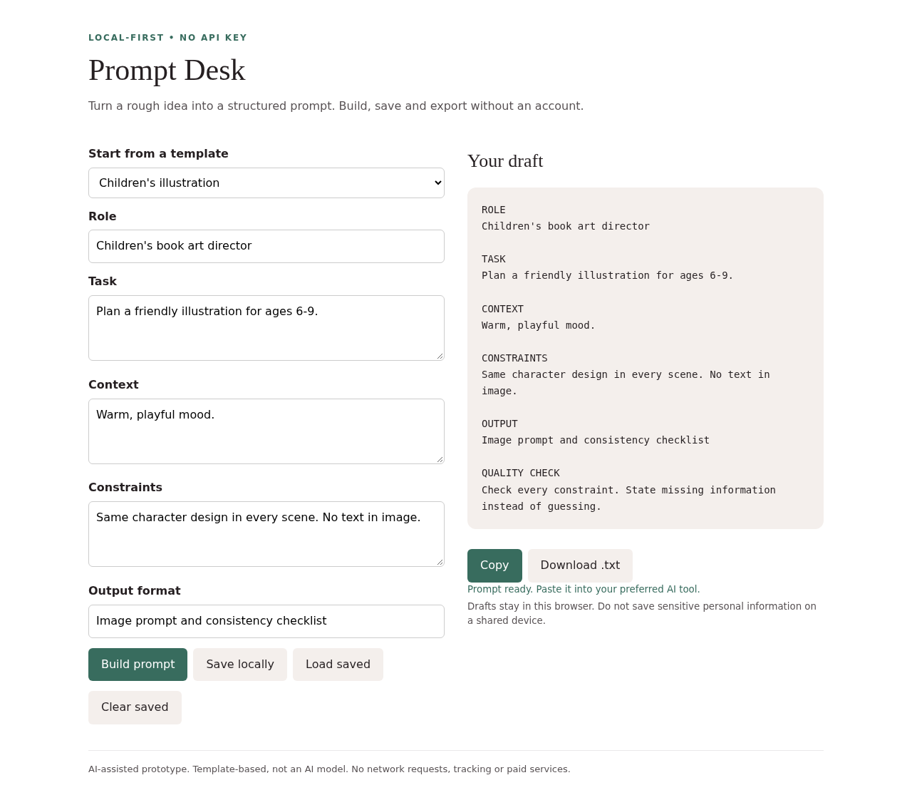

# Prompt Desk

Offline prompt builder with creative-work templates, local draft storage and text export.

## Status and authorship

An original, AI-assisted prototype prepared for Rahul Kumar's portfolio. It is not copied from another project and is not a claim of production deployment, independent manual authorship, or paid AI-model integration. The examples are fictional.

## Run locally

Open `index.html` in a modern browser. No install or server needed.

## Use

1. Pick a template or write a task.
2. Adjust role, context, constraints and output.
3. Build, copy or download your prompt. Save/load/clear stores one draft in browser localStorage.

## Limits

Not an AI model or prompt scorer. It structures your text using fixed templates. Clipboard may be restricted for local files; download is the fallback.

## Privacy and cost

No API keys, paid services, tracking, telemetry or network calls are required. All inputs stay on your device. Keep real resumes and application data out of public repositories and shared computers.

## Checks

Automated browser checks cover build/output, validation and responsive overflow; Prompt Desk also checks templates, save/load/clear and safe text rendering. See TESTING.md for repeatable manual checks.

## Next steps

Improve accessibility testing, add more examples and collect real-user feedback. No external contribution history or user numbers are claimed.

Optional automated core checks (Node.js 18+, no packages): `node test.mjs`.
